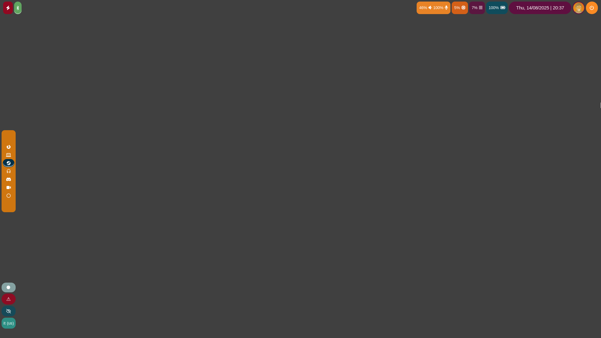

# Waybar Configuration

Welcome!

This is my waybar configuration. It is composed of a top bar and a left bar.

## Gambar Top

The top bar's main purpose is showing statuses.

### Left Modules

- [Tray](https://github.com/Alexays/Waybar/wiki/Module:-Tray);
- [Power-Profiles-Daemon](https://github.com/Alexays/Waybar/wiki/Module:-PowerProfilesDaemon);
- [Bluetooth](https://github.com/Alexays/Waybar/wiki/Module:-Bluetooth);
- [Privacy](https://github.com/Alexays/Waybar/wiki/Module:-Privacy);

### Center Modules

- [Media](https://github.com/Alexays/Waybar/wiki/Module:-Custom:-Examples);

### Right Modules

- [WirePlumber](https://github.com/Alexays/Waybar/wiki/Module:-WirePlumber);
- [CPU](https://github.com/Alexays/Waybar/wiki/Module:-CPU);
- [Memory](https://github.com/Alexays/Waybar/wiki/Module:-Memory);
- [Battery](https://github.com/Alexays/Waybar/wiki/Module:-Battery);
- [Clock](https://github.com/Alexays/Waybar/wiki/Module:-Clock);
- [User](https://github.com/Alexays/Waybar/wiki/Module:-User);
- Power Menu: configured using the default waybar configuration;

## Gambar Left

The left bar is mainly used for the the workspaces, plus some minimal useful information.

### Center Modules

- [Niri Workspaces](https://github.com/Alexays/Waybar/wiki/Module:-Niri#workspaces);

### Bottom Modules

- [Gamemode](https://github.com/Alexays/Waybar/wiki/Module:-Gamemode);
- [Backlight](https://github.com/Alexays/Waybar/wiki/Module:-Backlight);
- [Network](https://github.com/Alexays/Waybar/wiki/Module:-Network);
- [Idle Inhibitor](https://github.com/Alexays/Waybar/wiki/Module:-Idle-Inhibitor);
- [Niri Language](https://github.com/Alexays/Waybar/wiki/Module:-Niri#language);

